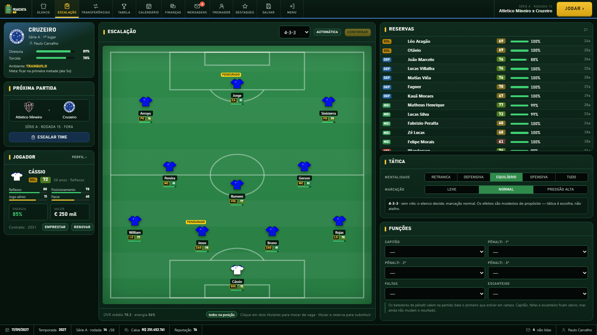
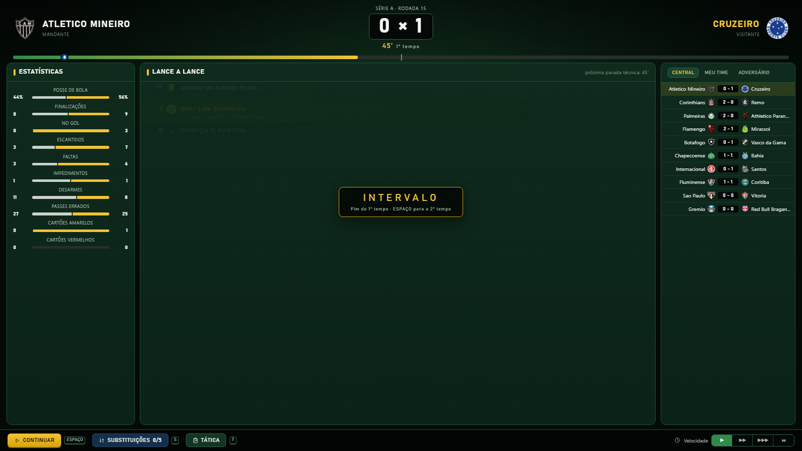
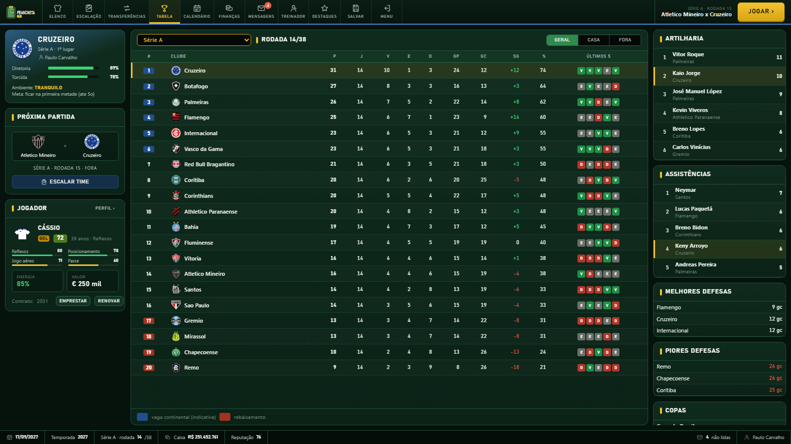
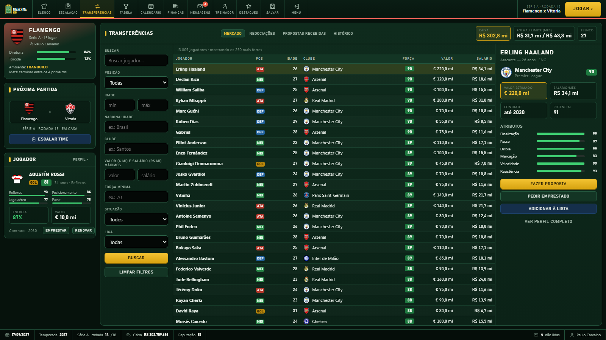
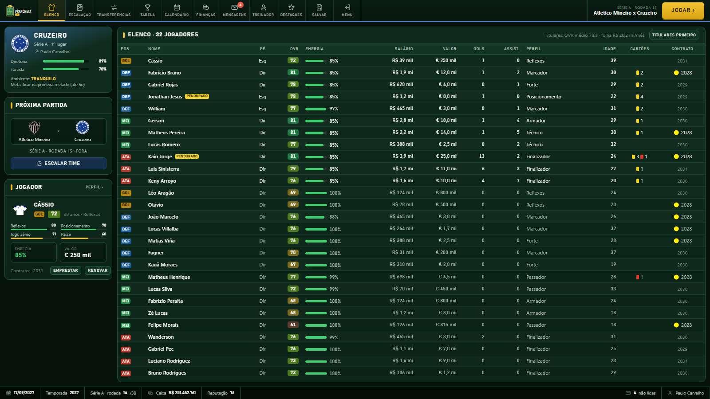
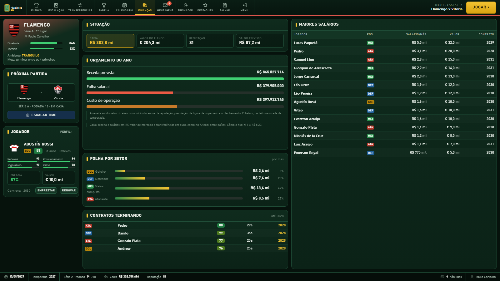
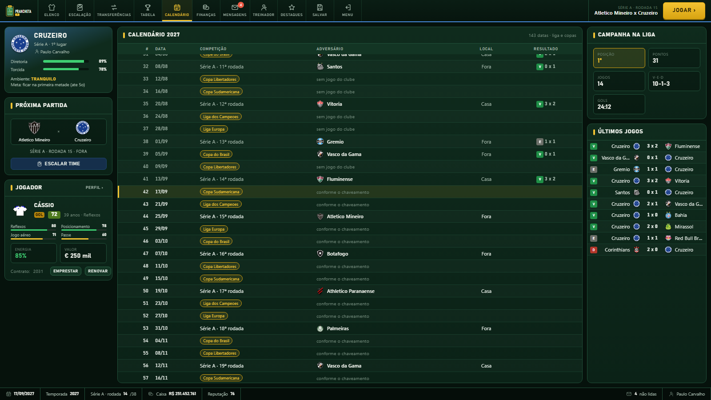
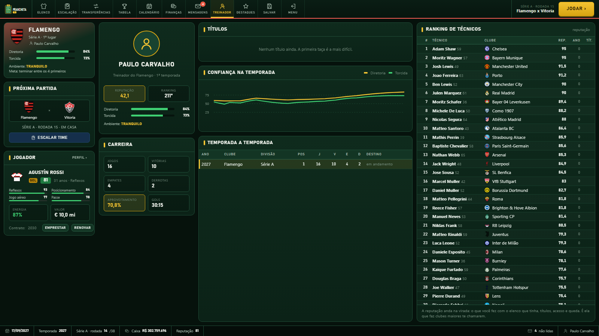
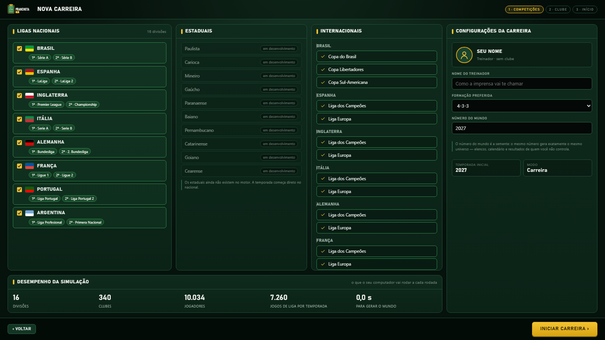

<div align="center">

# ⚽ PRANCHETA 11

**Um jogo de técnico de futebol que roda no navegador, com um motor de simulação calibrado contra o futebol real.**




</div>

Você assume um clube e escala o time, contrata, vende e empresta jogadores. Depois assiste à
partida minuto a minuto e mexe no time durante o jogo. Pela frente estão a liga, as copas e o
continental, temporada após temporada.

O mundo tem **16 países, 24 divisões, 468 clubes e quase 14 mil jogadores reais**: seis países
da Europa e os dez da Conmebol, de onde saem os clubes da Libertadores e da Sul-Americana.

A pergunta que guia o projeto não é se a interface está bonita. É se **a tabela no fim do ano é
crível**.

---

## Sumário

- [O que tem no jogo](#o-que-tem-no-jogo)
- [Telas](#telas)
- [Como rodar](#como-rodar)
- [O motor](#o-motor)
- [Arquitetura](#arquitetura)
- [Dados](#dados)

---

## O que tem no jogo

| | |
|---|---|
| 🏟️ **Partida ao vivo** | O relógio para a cada 5 minutos. Dá para fazer substituições, mudar a tática e escolher quem bate o pênalti. Os outros jogos da rodada aparecem em paralelo. |
| 🏆 **Competições reais** | Série A e B, Copa do Brasil, Libertadores e Sul-Americana no formato da Conmebol: grupos sorteados por potes e chave fixa das oitavas à final. Tem ainda a fase de liga da Champions e a Liga Europa. Os mata-matas são em ida e volta, em datas separadas, e o empate no agregado vai para os pênaltis, cobrança a cobrança. |
| 📅 **Calendário real** | A temporada vai de fevereiro a dezembro. As ligas jogam aos domingos e as copas no meio de semana, cada fase na janela de verdade: a pré-Libertadores em fevereiro, os grupos em abril e maio, a final em novembro. |
| 💸 **Mercado** | Propostas, contrapropostas, contrato, renovação e empréstimo. A IA também negocia entre si, e os clubes grandes às vezes perdem jogador para um menor. |
| 📊 **Finanças reais** | Receita, folha e prêmios na escala dos balanços de verdade. O valor de mercado aparece em **euro**. O caixa e os salários aparecem na **moeda do clube**: R$, £, US$ ou €. |
| 🩹 **Elenco vivo** | O desgaste vem dos minutos jogados. Tem lesão contada em dias, cartões e suspensões, evolução por idade e potencial, e revelação da base. |
| 🧑‍💼 **Carreira de técnico** | Diretoria e torcida avaliam você e podem demitir. Há reputação, ranking mundial de técnicos e convites de outros clubes. No fim da temporada saem a Bola de Ouro e os prêmios de cada liga. |
| 🎲 **Determinístico** | O save guarda a semente e as suas decisões. A mesma semente gera exatamente o mesmo mundo, em qualquer máquina. |

## Telas

<table>
<tr>
<td width="50%"><br><sub><b>Partida ao vivo</b>: estatísticas, lance a lance e os outros jogos da rodada</sub></td>
<td width="50%"><br><sub><b>Tabela</b>: classificação, artilharia, defesas e copas</sub></td>
</tr>
<tr>
<td><br><sub><b>Mercado</b>: 13 mil jogadores com filtros, valor em € e salário na moeda do clube</sub></td>
<td><br><sub><b>Elenco</b>: energia, cartões, perfil e contrato de cada jogador</sub></td>
</tr>
<tr>
<td><br><sub><b>Finanças</b>: orçamento do ano, folha por setor e maiores salários</sub></td>
<td><br><sub><b>Calendário</b>: liga e copas intercaladas, com os últimos resultados</sub></td>
</tr>
<tr>
<td><br><sub><b>Treinador</b>: confiança na temporada, carreira e ranking mundial de técnicos</sub></td>
<td><br><sub><b>Nova carreira</b>: escolha os países e as competições do seu mundo</sub></td>
</tr>
</table>

## Como rodar

Requer **Python 3.12**. O jogo em si depende só de NumPy.

```bash
git clone https://github.com/paulo-carvalho10/football-manager.git
cd football-manager
uv venv --python 3.12            # ou: python -m venv .venv
uv pip install numpy             # ou: pip install numpy

python -m fm.cli servir          # abre o jogo no navegador (http://localhost:8000)
```

Os escudos não fazem parte do repositório. Sem eles o jogo mostra a camisa do clube no lugar.
Para baixá-los, instale as dependências do importador e rode um comando por pack:

```bash
uv pip install beautifulsoup4 lxml pillow
python -m fm.cli escudos --pack brasil_serie_a
```

<details>
<summary><b>Outros comandos</b> (simulação, calibração, terminal)</summary>

```bash
python -m fm.cli temporada --liga brasil --seed 42    # uma temporada completa, sem interface
python -m fm.cli calibrar --temporadas 2000           # o portão de qualidade (ver abaixo)
python -m fm.cli perfis                               # o caráter de cada liga vem do dado
python -m fm.cli copa --liga copa_brasil              # liga x copa: o gigante ganha menos copa
python -m fm.cli jogar --clube Santos                 # a carreira no terminal
python -m fm.cli calibrar-overall                     # recalibra o overall da tela
```

Testes: `python -m pytest` · Lint: `ruff check .`

</details>

Também existe uma [demonstração do motor no navegador](https://paulo-carvalho10.github.io/football-manager/),
que simula temporadas e roda o portão de calibração sem instalar nada.

## O motor

### O portão de calibração

O centro do projeto é o `fm/calibration.py`. Ele roda milhares de temporadas e compara as
métricas com intervalos do futebol real. Se um alvo quebra, o build fica vermelho.

A medição abaixo usa 760 mil partidas numa liga de referência de 20 clubes, em returno duplo:

| métrica | medido | alvo |
|---|---|---|
| gols por jogo | 2,60 | 2,55 – 2,80 |
| 0 × 0 | 7,5% | 6,5 – 9,5% |
| casa / empate / fora | 46,1 / 24,7 / 29,2 | 43–47 / 23–27 / 28–31 |
| margem de 3+ gols | 14,3% | 11,5 – 15,5% |
| margem de 4+ gols | 4,8% | 3,5 – 6,0% |
| pontos do campeão | 76,1 | 74 – 81 |
| pontos do lanterna | 28,8 | 22 – 31 |
| o melhor elenco é campeão | 34,6% | 33 – 46% |

A última linha é a alma do gênero. Se o melhor elenco ganha 90% das vezes, o jogo vira uma
planilha. Se ganha 10%, vira um dado.

### A fórmula

```
z = (ovr_efetivo - 68) / 20
d = tanh((z_casa - z_fora) / 1.20)          <- saturação
λ_casa = gols_base · exp(+0.58·d + mando/2)
λ_fora = gols_base · exp(-0.58·d - mando/2)
gols ~ Poisson(λ)
```

- **A saturação (`tanh`) impede o 9 × 0.** Sem ela, uma diferença de 26 pontos de overall gera
  22% de jogos com 3+ gols de margem, contra ~14% no real. Com ela, num 82 × 56 o pequeno ainda
  vence 9,3% das vezes.
- **Não existe ruído anônimo.** Toda a variância vem de causas com nome: desgaste, moral, forma,
  clássico e mando. O jogador entende "meu time estava morto, jogou quarta e domingo". Ele não
  entende "o multiplicador aleatório deu 0,6".
- **Desgaste em pontos de overall, com teto.** O motor usa a *diferença* de força, então
  desgaste igual nos dois lados se cancela. Ele só pesa quando é assimétrico: o desgaste máximo
  leva a derrota do favorito (78 × 64) de 14,3% para 19,0%.

### Outras calibrações

- **Overall na escala das cartinhas.** O motor tem uma escala interna própria. A tela a converte,
  percentil por percentil, para a distribuição do EA FC. A tabela de conversão foi medida em
  3.775 jogadores casados por nome, idade e clube. As cartinhas são só gabarito: nenhum rating é
  copiado.
- **Dinheiro na escala real.** A receita foi ajustada contra faturamentos conhecidos (Deloitte
  Football Money League e balanços dos clubes brasileiros). O salário acompanha o valor de
  mercado, e o prêmio da liga é proporcional à receita da divisão.
- **Mundo estacionário.** Testes de 20 temporadas garantem que o overall médio e a reputação não
  inflam, que os elencos não esvaziam e que o título circula.

## Arquitetura

```
fm/
├── eventos.py, match.py     o motor da partida (lance a lance e o modo rápido)
├── carreira.py              a carreira: agenda, decisões, save por replay
├── copa.py, torneio.py      mata-mata, grupos, fase de liga suíça
├── mercado.py, negocios.py  a janela da IA e as negociações do usuário
├── financas.py, moeda.py    receita, folha, prêmios; euro no motor, moeda local na tela
├── temporada.py             envelhecimento, evolução, aposentadoria, base
├── calibration.py           o portão de qualidade
├── servidor.py              servidor HTTP da biblioteca padrão, sem framework
├── web/                     a interface: HTML, CSS e JavaScript puros
└── importer/                a importação de dados (fica fora do motor)
tests/                       mais de 300 testes, incluindo determinismo entre processos
```

Decisões que valem mencionar:

- **O motor depende só de NumPy.** O importador (BeautifulSoup e Pillow) é um extra separado.
  O jogo não baixa página.
- **O save guarda a semente e as decisões**, não o estado. Carregar é refazer o caminho. Por
  isso cada sorteio vem de um fluxo de números com nome estável, e um teste compara o mundo
  gerado em dois processos diferentes.
- **Nenhuma regra de jogo mora no navegador.** A tela pede estado ao servidor, desenha e devolve
  o que o usuário decidiu.

## Dados

- Os elencos, valores de mercado e idades vêm do **Transfermarkt**, importados por
  `fm/importer/`. O overall e o potencial são derivados desses campos em `fm/ratings.py`: são
  uma estimativa, não o rating oficial de ninguém.
- O **EA FC** serviu só de referência para calibrar a escala do overall. Nenhum rating dele é
  copiado.
- Os **escudos** não são versionados. Cada um baixa os seus, para uso pessoal.

Este é um projeto pessoal e não tem vínculo com clubes, ligas, federações, Transfermarkt ou EA.
Os nomes e as marcas pertencem aos seus donos.
